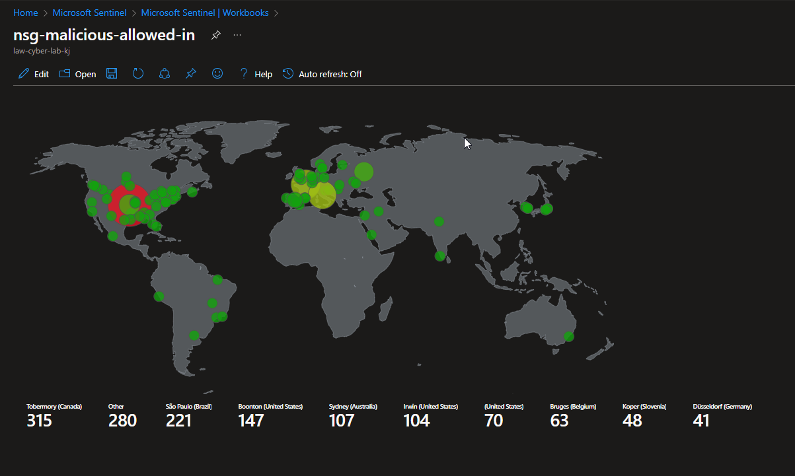
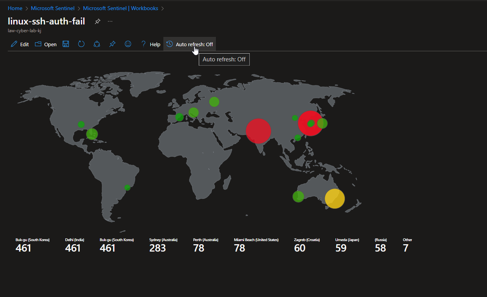
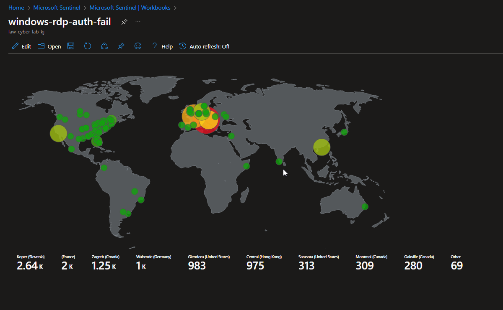

# Azure SOC + Honeynet Project (With Live Traffic)

<!-- Azure Diagram -->

    

<small><em>OpenAI. (2024). ChatGPT [Large language model]. /g/g-pmuQfob8d-image-generator</em></small>

## Introduction

I used Microsoft Azure to build a hands-on cybersecurity incident response lab for this project. I created a honeynet exposed to the open internet without any security controls to collect data on malicious activity. 

I monitored traffic over 48 hours without security controls in the simulated SOC environment. Data was collected by ingesting logs from various sources into a Log Analytics workspace, which Microsoft Sentinel utilized to create attack maps and security incidents based on alert triggers. I resolved all security incidents by the NIST 800-61 protocol, implemented controls, including NIST 800-53 standards, and compared the results after another 48 hours. 

I used KQL to collect metrics from various sources to assess the effectiveness of our security controls and ensure data security. The metrics include:
SecurityEvent (Windows Event Logs)
Syslog (Linux Event Logs)
SecurityAlert (Log Analytics Alerts Triggered)
SecurityIncident (Incidents created by Sentinel)
AzureNetworkAnalytics_CL (Malicious Flows allowed into the honeynet)

  
## Before and After Security Controls

## Before and After Security Controls

<em><small>With some creative liberties, of course.</small></em>

    
    

<small><em>OpenAI. (2024). ChatGPT [Large language model]. /g/g-pmuQfob8d-image-generator</em></small>
    
The architecture of the mini honeynet in Azure consists of the following components:

- Virtual Network (VNet)
- Network Security Group (NSG)
- Virtual Machines (2 windows, 1 Linux)
- Log Analytics Workspace
- Azure Key Vault
- Azure Storage Account
- Microsoft Sentinel

For the "BEFORE" metrics, all resources were originally deployed, exposed to the internet. The Virtual Machines had both their Network Security Groups and built-in firewalls wide open, and all other resources are deployed with public endpoints visible to the Internet; aka, no use for Private Endpoints.

For the "AFTER" metrics, Network Security Groups were hardened by blocking ALL traffic with the exception of my admin workstation, and all other resources were protected by their built-in firewalls as well as Private Endpoint.

## Attack Maps Before Hardening / Security Controls

  
  
  

## Metrics Before Hardening / Security Controls

The following table shows the metrics we measured in our insecure environment for 24 hours:
Start Time 2023-03-15 17:04:29
Stop Time 2023-03-16 17:04:29

| Metric                   | Count |
| ------------------------ | ----- |
| SecurityEvent            | 19470 |
| Syslog                   | 3028  |
| SecurityAlert            | 10    |
| SecurityIncident         | 348   |
| AzureNetworkAnalytics_CL | 843   |

## Attack Maps After Hardening / Security Controls

`All map queries actually returned no results due to no instances of malicious activity for the 24 hour period after hardening.`

## Metrics After Hardening / Security Controls

The following table shows the metrics we measured in our environment for another 24 hours, but after we have applied security controls:
Start Time 2023-03-18 15:37
Stop Time 2023-03-19 15:37

| Metric                   | Count |
| ------------------------ | ----- |
| SecurityEvent            | 8778  |
| Syslog                   | 25    |
| SecurityAlert            | 0     |
| SecurityIncident         | 0     |
| AzureNetworkAnalytics_CL | 0     |

## Conclusion

In this project, a mini honeynet was constructed in Microsoft Azure and log sources were integrated into a Log Analytics workspace. Microsoft Sentinel was employed to trigger alerts and create incidents based on the ingested logs. Additionally, metrics were measured in the insecure environment before security controls were applied, and then again after implementing security measures. It is noteworthy that the number of security events and incidents were drastically reduced after the security controls were applied, demonstrating their effectiveness.

It is worth noting that if the resources within the network were heavily utilized by regular users, it is likely that more security events and alerts may have been generated within the 24-hour period following the implementation of the security controls.

## Usage

Explain how to interact with the honeynet, monitor activities, and trigger incident responses.

## Methodology

Describe the approach taken to deploy the honeynet, implement NIST 800-53 standards, and measure the impact on incident response.

## Results

Present the metrics captured before and after deploying NIST 800-53 standards. Include any notable findings or improvements in incident response.

## Contributing

Provide guidelines for how others can contribute to the project or use it as a reference for their own implementations.

## License

Specify the license under which the project is distributed.

## Acknowledgements

